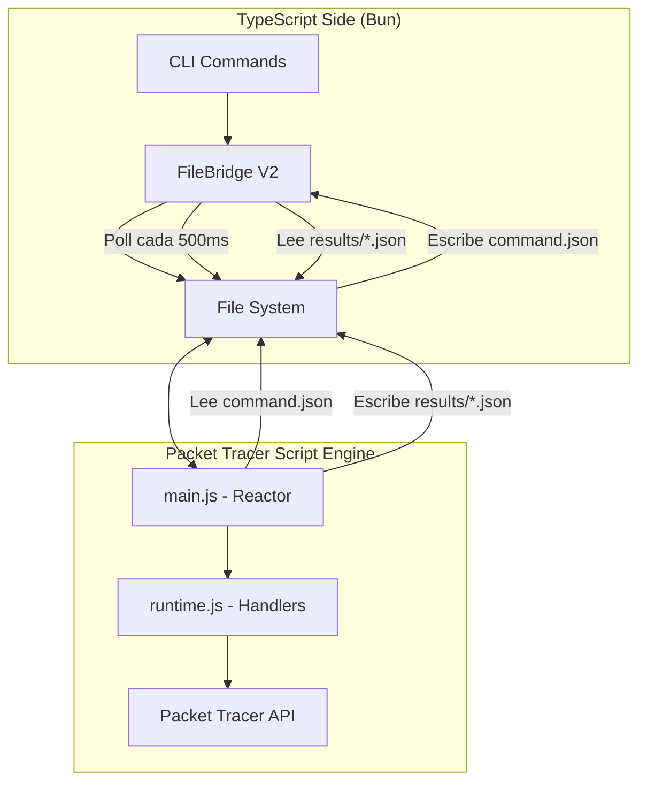

# 🏗️ PT Control V2 - Arquitectura

## Visión General

PT Control V2 es un sistema de automatización para Cisco Packet Tracer que utiliza una arquitectura simplificada y reactiva. Toda la complejidad está en el lado de TypeScript (FileBridge), mientras que Packet Tracer solo actúa como un ejecutor reactivo.

---

## 📐 Diagrama de Arquitectura



---

## 🔄 Flujo de Comandos

### 1. **CLI → FileBridgeV2**
El usuario ejecuta un comando:
```bash
bun run pt vlan apply SW1 10 20 30
```

### 2. **FileBridgeV2 → File System**
FileBridge escribe el comando en la cola:
```typescript
// commands/cmd_000000000001.json
{
  "id": "cmd_000000000001",
  "type": "configIos",
  "payload": {
    "device": "SW1",
    "commands": ["vlan 10", "name VLAN10"]
  },
  "createdAt": 1775110011522
}
```

### 3. **PT main.js → Polling**
main.js polla `command.json` cada 500ms:
```javascript
// main.js (simplificado)
setInterval(function() {
  if (fm.fileExists(COMMAND_FILE)) {
    var cmd = JSON.parse(fm.getFileContents(COMMAND_FILE));
    var result = runtimeFn(cmd.type, cmd.payload);
    fm.writePlainTextToFile(RESULTS_DIR + "/" + cmd.id + ".json", JSON.stringify(result));
    fm.deleteFile(COMMAND_FILE);
  }
}, 500);
```

### 4. **PT runtime.js → Ejecución**
El runtime ejecuta el handler correspondiente:
```javascript
// runtime.js
function handleConfigIos(payload) {
  var device = getNet().getDevice(payload.device);
  var term = device.getCommandLine();
  // ... ejecutar comandos IOS
  return { ok: true, device: payload.device };
}
```

### 5. **PT → File System (Resultado)**
PT escribe el resultado:
```json
// results/cmd_000000000001.json
{
  "id": "cmd_000000000001",
  "type": "configIos",
  "result": {
    "startedAt": 1775110012000,
    "status": "completed",
    "ok": true,
    "value": { "device": "SW1" }
  }
}
```

### 6. **FileBridgeV2 → Lee Resultado**
FileBridge lee el resultado y resuelve la promesa:
```typescript
const result = await bridge.sendCommandAndWait("configIos", payload, 15000);
```

---

## 🧩 Componentes Principales

### **FileBridge V2** (`packages/file-bridge/src/file-bridge-v2.ts`)

Responsabilidades:
- Gestión de cola de comandos (`commands/`, `in-flight/`, `results/`)
- Monitoreo automático de heartbeat (cada 2s)
- Auto-snapshot del estado (cada 3s)
- Event streaming para debugging
- Backpressure y control de capacidad

Configuración típica:
```typescript
const bridge = new FileBridgeV2({
  root: "/Users/andresgaibor/pt-dev",
  consumerId: "exhaustive-tester",
  autoSnapshotIntervalMs: 3000,
  heartbeatIntervalMs: 1500,
  maxPendingCommands: 50,
});
```

### **PT main.js** (`packages/pt-runtime/src/templates/main.ts`)

Única responsabilidad: ser reactivo.
- Poll `command.json` cada 500ms
- Ejecutar `runtime(payload)`
- Escribir resultado en `results/<id>.json`
- Escribir heartbeat cada 5s

**213 líneas** (reducido de 720 líneas originales - 70% reducción)

### **PT runtime.js** (`packages/pt-runtime/src/templates/`)

Handlers específicos por dominio:
- `device-handlers-template.ts`: addDevice, removeDevice, renameDevice, moveDevice
- `link-handlers-template.ts`: addLink, removeLink
- `ios-config-handlers-template.ts`: configIos
- `ios-exec-handlers-template.ts`: execIos, showVersion, showRunningConfig
- `session-template.ts`: Gestión de sesiones IOS persistentes
- `inspect-handlers-template.ts`: inspect device

### **compose.ts** (`packages/pt-runtime/src/compose.ts`)

Generador que combina todos los templates en un solo `runtime.js`.

---

## 📁 Estructura de Directorios

```
/Users/andresgaibor/pt-dev/
├── main.js                 # PT reactor (generado)
├── runtime.js              # PT handlers (generado)
├── command.json            # Comando actual a ejecutar
├── heartbeat.json          # Heartbeat de PT (cada 5s)
├── commands/               # Cola de comandos pendientes
│   ├── cmd_000000000001.json
│   └── cmd_000000000002.json
├── in-flight/              # Comandos en ejecución
│   └── cmd_000000000000.json
├── results/                # Resultados completados
│   ├── cmd_000000000000.json
│   └── cmd_000000000001.json
├── sessions/               # Sesiones IOS persistentes
│   ├── ios-sessions.json
│   └── heartbeat.json
└── consumer-state/         # Estado del consumidor
    ├── snapshot.json
    └── events.log
```

---

## 🔧 Protocolo de Comunicación

### Command Envelope
```typescript
interface BridgeCommandEnvelope<T> {
  id: string;              // cmd_000000000001
  type: string;            // "addDevice", "configIos", etc.
  payload: T;              // Datos específicos del comando
  createdAt: number;       // Timestamp
  expiresAt?: number;      // Optional expiration
}
```

### Result Envelope
```typescript
interface BridgeResultEnvelope<T> {
  id: string;
  type: string;
  result: {
    startedAt: number;
    completedAt?: number;
    status: "completed" | "failed" | "timeout";
    ok: boolean;
    value?: T;
    error?: { message: string; code?: string };
  };
}
```

---

## 🛡️ Crash Recovery

### Heartbeat Monitoring
FileBridge monitorea `heartbeat.json` cada 2 segundos:
- Si no hay heartbeat por >15s → PT se asume muerto
- Comandos en `in-flight/` se mueven a `dead-letter/`
- Sesiones IOS se marcan como stale

### Auto-Snapshot
Cada 3 segundos:
- Snapshot completo del estado de PT
- Guarda en `consumer-state/snapshot.json`
- Permite recovery después de crash

### Session Persistence
Sesiones IOS persisten en disco:
- `sessions/ios-sessions.json`
- Modo actual (user-exec, priv-exec, config, etc.)
- Paging, awaiting-confirm, etc.
- Max age: 5 minutos
- LRU eviction cuando hay >200 sesiones

---

## 📊 Métricas y Monitoreo

### Backpressure
```typescript
const stats = bridge.getBackpressureStats();
// {
//   maxPending: 50,
//   currentPending: 12,
//   availableCapacity: 38,
//   utilizationPercent: 24
// }
```

### Event Streaming
```typescript
bridge.on("*", (event) => {
  console.log(event.type, event.payload);
});
// Eventos: command-enqueued, command-picked, result-published, pt-heartbeat-ok, pt-snapshot

```

### Diagnostics
```typescript
const health = bridge.diagnostics();
// {
//   status: "healthy" | "degraded" | "unhealthy",
//   lease: { active, ownerId, ageMs },
//   queues: { pendingCommands, inFlight, results },
//   journal: { currentFileSize, rotatedFiles, lastSeq },
//   consumers: [...],
//   issues: []
// }
```

---

## 🎯 Principios de Diseño

1. **PT es tonto, FileBridge es inteligente**: Toda la lógica compleja está en TypeScript
2. **Reactividad simple**: PT solo lee, ejecuta, escribe
3. **Persistencia en disco**: Todo estado crítico está en archivos
4. **Crash-safe**: Recovery automático después de fallos
5. **Backpressure real**: Cola con capacidad limitada
6. **Observabilidad**: Events, logs, diagnostics

---

## 📈 Comparación: V1 vs V2

| Característica | V1 (Legacy) | V2 (Actual) |
|---------------|-------------|-------------|
| main.js líneas | 720 | 213 |
| Complejidad en PT | Sí | No |
| Cola de comandos | single-slot (`command.json`) | multi-archivo (`commands/`) |
| Crash recovery | Limitado | Completo |
| Backpressure | No | Sí (500 commands) |
| Heartbeat monitoring | Manual | Automático (2s) |
| Auto-snapshot | No | Sí (3s) |
| Event streaming | No | Sí |
| Session persistence | En memoria | En disco |

---

## 🔗 Documentos Relacionados

- [PT_CONTROL_MODELS.md](./PT_CONTROL_MODELS.md) - Catálogo de dispositivos soportados
- [PT_CONTROL_HANDLERS.md](./PT_CONTROL_HANDLERS.md) - Referencia de handlers
- [PT_CONTROL_TROUBLESHOOTING.md](./PT_CONTROL_TROUBLESHOOTING.md) - Guía de troubleshooting
